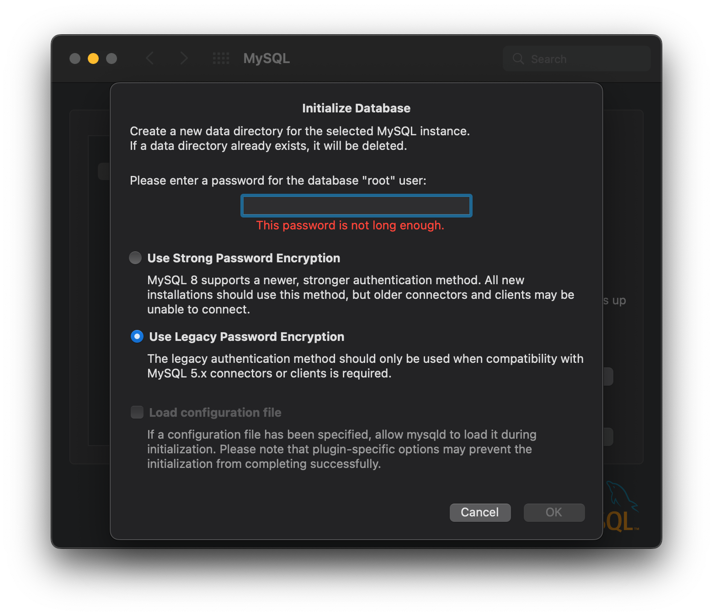
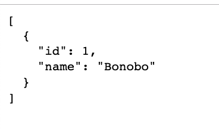

# nodeJS Express Boilerplate

## Environment

- macOS v12.x
- nodeJS v10.13.0
- MySQL v8.0.3.1
- (optional) Docker v4.15.0 

## Setup

### Install dependencies

#### Node

Run the following commmand to install dependencies required by nodeJS

    npm install

### Install MySQL

Download MySQL from [here](https://dev.mysql.com/downloads/mysql/)

Note. when installing you will need the legacy password support for older clients (if you forget you can change this from System Preferences) (added to TODO below)

### Environment Variables

Export the following based on your local MySQL setup:

    export NODE_ENV=dev
    export DATABASE_HOST="<INSERT HERE>"
    export DATABASE_NAME="<INSERT HERE>"
    export DATABASE_USER="<INSERT HERE>"
    export DATABASE_PASSWORD="<INSERT HERE>"

### Database

Start MySQL locally and run the setup script

  `bash scripts/datbabase/create-database.sh`

## Usage

### Node

Run the following commmand to start the server via nodeJS

    npm run start

Open a browser at http://localhost:3000/ 

If all goes well you should see the artists output 🎉

[demo](./docs/images/demo/jpg)

### Docker

Make sure you have the [Docker desktop app](https://www.docker.com/products/docker-desktop/) installed and running

### Setup

Run the following commmand to build Docker image

  bash scripts/docker-build.sh

### Usage

Run the following commmand to build Docker image

  bash scripts/docker-run.sh

## TODO

- [x] Basic nodeJS express server with app route
- [x] Database (MySQL)
  - [x] Local setup script
  - [x] Local dummy data (seed)
  - [x] Database helper class
  - [x] Basic helper for a database entity 
  - [x] Update API to return from database 
  - [x] Optmize connections (Connection pool)
  - [ ] Cloud DB
  - [ ] Add support for newer MySQL password type
  - [ ] Move to PostgresSQL for Production
  - [ ] (optional) Move to SQLite for Development
  - [ ] RDS (see AWS)
- [ ] Promisify the callbacks (using utils)
- [x] Controllers / pattern for Routing (e.g. MVC))
- [ ] Fix .env support
- [ ] Resolve cors support
- [x] Docker
- [ ] ESLint
- [ ] TypeScript
- [ ] Unit Tests
- [ ] Integration Tests
- [ ] CI / CD
  - [ ] CircleCI
- [ ] Deploy
  - [ ] AWS
- [ ] Update dependencies
